# FastPlay — Memoria del Proyecto
## Sistema de Gestión y Organización de Fútbol Amateur

* **Asignatura:** Proyecto Intermodular
* **Ciclo:** 2º Curso de Desarrollo de Aplicaciones Web (DAW)
* **Curso Académico:** 2025 / 2026
* **Centro Educativo:** I.E.S. Ceuta

---

## Índice

1. [Introducción](#1-introducción)
2. [Objeto del Proyecto](#2-objeto-del-proyecto)
3. [Objetivos y Alcance](#3-objetivos-y-alcance)
4. [Estudio de Mercado](#4-estudio-de-mercado)
5. [Requisitos del Proyecto](#5-requisitos-del-proyecto)
6. [Arquitectura del Sistema y Diagramas](#6-arquitectura-del-sistema-y-diagramas)
7. [Diseño de la Base de Datos](#7-diseño-de-la-base-de-datos)
8. [Diseño de Interfaces (DIW)](#8-diseño-de-interfaces-diw)
9. [Desarrollo en Entorno Servidor (DWES)](#9-desarrollo-en-entorno-servidor-dwes)
10. [Desarrollo en Entorno Cliente (DWEC)](#10-desarrollo-en-entorno-cliente-dwec)
11. [Propuesta de Escalabilidad y Arquitectura Futura](#11-propuesta-de-escalabilidad-y-arquitectura-futura)
12. [Conclusiones](#12-conclusiones)
13. [Bibliografía](#13-bibliografía)

---

## 1. Introducción

¿Cuántas veces te ha pasado que te apetece echar un partido de fútbol un martes por la tarde y es imposible cuadrar al grupo de amigos? Siempre hay alguien que a última hora se cae porque "le duele la rodilla", otro que no puede por trabajo y el clásico que te deja en "visto". Al final, organizar una pachanga de fútbol amateur se convierte en un dolor de cabeza diario.

**FastPlay** nace para dar solución a esta frustración. Es una plataforma web ligera, moderna y semántica diseñada específicamente para futbolistas amateur, delegados y capitanes de equipos locales. Con FastPlay, el proceso de buscar un equipo, pactar un encuentro contra un rival, reservar un terreno de juego y registrar los resultados de tus partidos se gestiona de forma intuitiva, sin necesidad de chats caóticos ni herramientas complejas de terceros.

---

## 2. Objeto del Proyecto

El propósito de FastPlay es digitalizar y unificar las necesidades del fútbol amateur local en una única aplicación web modular y auto-gestionada. 

La plataforma proporciona soporte técnico e interfaz gráfica para cuatro flujos fundamentales:

1. **Conexión Deportiva:** Los jugadores pueden registrar su perfil deportivo (su posición de preferencia, estadísticas individuales, datos antropométricos básicos) y solicitar su ingreso en equipos de su zona geográfica.
2. **Gestión de Equipos:** Permite a los usuarios fundar equipos, actuar como capitanes y administrar las altas y bajas de la plantilla de manera autónoma.
3. **Logística de Encuentros:** Los capitanes pueden organizar partidos seleccionando un rival, determinando la fecha del encuentro y escogiendo un campo disponible en la localidad.
4. **Estructura Competitiva Local:** Implementación de liguillas locales y sistemas de puntuación que actualizan de forma automática la clasificación general en base al resultado de los partidos finalizados.

---

## 3. Objetivos y Alcance

### 3.1. Objetivos Técnicos y de Diseño
* **Diseño Mobile-First Real:** Garantizar la accesibilidad total desde dispositivos móviles, priorizando controles táctiles limpios y diseños fluidos con CSS moderno (sin depender de Bootstrap o Tailwind).
* **Desacoplamiento Tecnológico:** Desarrollar un backend MVC (Modelo-Vista-Controlador) nativo en PHP 8.1+ sin dependencias de frameworks masivos (como Laravel o Symfony), lo que permite justificar cada línea de código ante el tribunal de TFG.
* **Persistencia Integrada:** Uso de una base de datos SQLite ligera y autocontenida por motivos de portabilidad y facilidad de despliegue en entornos locales y de servidor.
* **Interactividad Dinámica (AJAX):** Utilizar JavaScript vanilla para dar feedback inmediato al usuario en validaciones de formularios y carga asíncrona de datos en la pantalla de inicio.

### 3.2. Roles del Sistema
A nivel técnico y operativo, la plataforma distingue tres niveles de acceso basados en variables de sesión:

* **Visitante (Usuario no autenticado):** Puede explorar la página de inicio, consultar el listado de equipos y partidos públicos, registrar una nueva cuenta e iniciar sesión.
* **Jugador / Capitán (Usuario autenticado):** Puede gestionar su perfil deportivo y crear un equipo. Al crear un equipo, se le asigna dinámicamente el rol funcional de **Capitán** sobre el mismo, dándole privilegios para editar la información del equipo, añadir/eliminar jugadores y registrar resultados de los partidos que dispute su escuadra.
* **Administrador:** Acceso completo al panel de control centralizado (`/admin`) para dar de alta ligas y campos de fútbol, además de supervisar el estado global de la base de datos.

---

## 4. Estudio de Mercado

Las soluciones actuales en el mercado del deporte amateur presentan importantes carencias para el usuario medio:

| Aplicación | Ventajas | Desventajas / Problemas | Solución en FastPlay |
| :--- | :--- | :--- | :--- |
| **TeamApp** | Gestión muy completa de clubes y calendarios deportivos. | Interfaz anticuada, sobrecargada de opciones y obligatoriedad de uso de planes premium. | Diseño minimalista, centrado en el flujo de partidos sin fricciones. |
| **Playfinder** | Buena gestión de reservas de instalaciones. | Exclusivo para Reino Unido; no integra plantillas de equipos ni clasificaciones. | Foco territorial en el ámbito local y vinculación de ligas automatizadas. |
| **Meetup** | Facilidad para convocar eventos grupales abiertos. | Genérico, no deportivo; carece de perfiles de juego, estadísticas o control de equipos. | Ficha de jugador dedicada y registro de clasificaciones reales. |

> [!NOTE]
> FastPlay se desmarca de la competencia al presentarse como un software libre de publicidad y enfocado estrictamente en la agilidad de uso: un capitán puede concertar y programar un encuentro en menos de 60 segundos.

---

## 5. Requisitos del Proyecto

### 5.1. Requisitos Funcionales (RF)
* **RF1 - Gestión de Cuentas:** Registro de usuarios con contraseña cifrada e inicio de sesión seguro.
* **RF2 - Ficha de Perfil Deportivo:** Edición de datos del jugador (posición en el campo, dorsal de preferencia) y visualización de estadísticas.
* **RF3 - Gestión de Equipos:** Creación de equipos de fútbol indicando nombre, ciudad y descripción. El creador se convierte en capitán del equipo.
* **RF4 - Control de Plantillas:** Incorporación de jugadores a un equipo mediante su correo electrónico registrado, con control de redundancias y límites.
* **RF5 - Programación de Partidos:** Programación de encuentros seleccionando fecha, equipo rival y campo de juego de una lista de instalaciones disponibles.
* **RF6 - Registro de Marcadores:** Los capitanes de los equipos implicados (local o visitante) o el administrador del sistema pueden registrar el resultado final del encuentro.
* **RF7 - Sistema de Ligas y Clasificación:** Las ligas agrupan a los equipos y calculan de forma automática la clasificación general (puntos, partidos jugados/ganados/empatados/perdidos, diferencia de goles) al finalizar los partidos.
* **RF8 - Panel de Administración:** Consola exclusiva para la creación de campos de juego e inicialización de ligas.

### 5.2. Requisitos No Funcionales (RNF)
* **RNF1 - Usabilidad y Carga:** Interfaz moderna y responsive con tiempos de respuesta locales del servidor inferiores a 200 ms.
* **RNF2 - Seguridad de los Datos:** Prevención de vulnerabilidades OWASP Top 10 (cifrado de contraseñas con `bcrypt`, prevención de inyecciones SQL con sentencias preparadas de PDO, y protección contra ataques CSRF).
* **RNF3 - Portabilidad:** Configuración simple mediante SQLite para evitar dependencias de un motor de bases de datos relacionales externo (como MySQL o PostgreSQL) durante la defensa del proyecto.
* **RNF4 - Accesibilidad (WCAG):** Navegación semántica estructurada, contraste adecuado de colores y uso de atributos `aria-*` en validaciones asíncronas de formularios.

---

## 6. Arquitectura del Sistema y Diagramas

### 6.1. Casos de Uso
El siguiente diagrama detalla cómo interactúan los diferentes actores con los casos de uso principales de FastPlay:

```mermaid
leftToRightDirection
actor Visitante as "Usuario Visitante"
actor Jugador as "Jugador / Capitán"
actor Admin as "Administrador"

rectangle FastPlay {
  Visitante --> (Registrarse / Iniciar Sesión)
  Visitante --> (Explorar Equipos y Ligas)
  
  Jugador --> (Crear / Editar Equipo)
  Jugador --> (Añadir Miembros por Email)
  Jugador --> (Programar Partido con Rival)
  Jugador --> (Registrar Resultado del Partido)
  Jugador --> (Editar Perfil Deportivo)
  
  Admin --> (Gestionar Campos y Ligas)
  Admin --> (Moderar Datos de la Plataforma)
}
```

### 6.2. Diagrama de Flujo de Datos (Arquitectura MVC)
La petición del usuario en el navegador es recogida por el enrutador central de PHP, que delega en el controlador adecuado. Este interactúa con la base de datos a través de modelos estáticos y devuelve la respuesta renderizada al cliente:

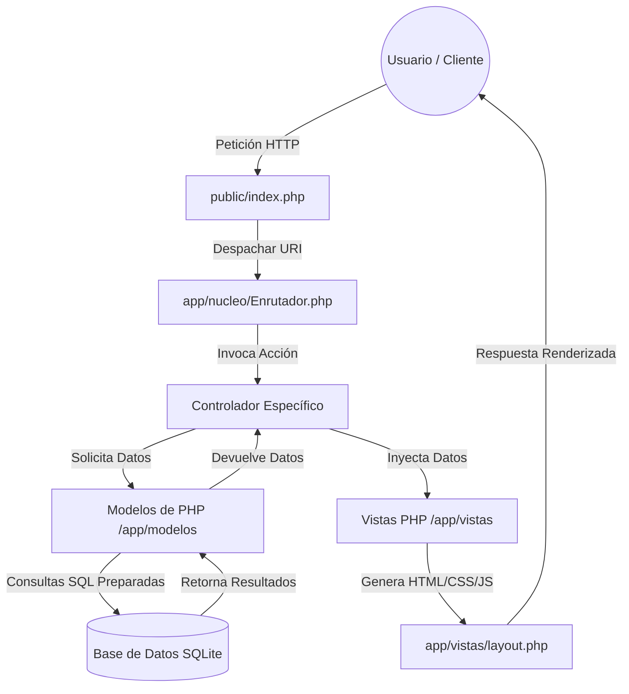
```mermaid
graph TD
    Usuario((Usuario / Cliente)) -->|Petición HTTP| Index[public/index.php]
    Index -->|Despachar URI| Router[app/nucleo/Enrutador.php]
    Router -->|Invoca Acción| Controller[Controlador Específico]
    Controller -->|Solicita Datos| Model[Modelos de PHP /app/modelos]
    Model -->|Consultas SQL Preparadas| DB[(Base de Datos SQLite)]
    DB -->|Retorna Resultados| Model
    Model -->|Devuelve Datos| Controller
    Controller -->|Inyecta Datos| View[Vistas PHP /app/vistas]
    View -->|Genera HTML/CSS/JS| Layout[app/vistas/layout.php]
    Layout -->|Respuesta Renderizada| Usuario
```

---

## 7. Diseño de la Base de Datos

### 7.1. Relaciones y Modelo Entidad-Relación
El modelo de datos está diseñado en español, facilitando su legibilidad y coherencia técnica con el código del backend. 

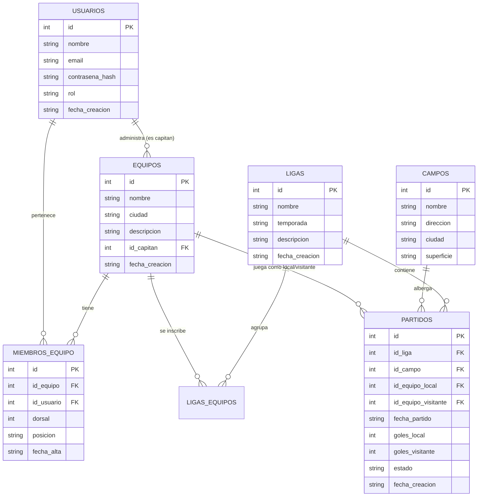
```mermaid
erDiagram
    USUARIOS ||--o{ EQUIPOS : "administra (es capitan)"
    USUARIOS ||--o{ MIEMBROS_EQUIPO : "pertenece"
    EQUIPOS ||--o{ MIEMBROS_EQUIPO : "tiene"
    EQUIPOS ||--o{ LIGAS_EQUIPOS : "se inscribe"
    LIGAS ||--o{ LIGAS_EQUIPOS : "agrupa"
    EQUIPOS ||--o{ PARTIDOS : "juega como local/visitante"
    CAMPOS ||--o{ PARTIDOS : "alberga"
    LIGAS ||--o{ PARTIDOS : "contiene"
    
    USUARIOS {
        int id PK
        string nombre
        string email
        string contrasena_hash
        string rol
        string fecha_creacion
    }
    EQUIPOS {
        int id PK
        string nombre
        string ciudad
        string descripcion
        int id_capitan FK
        string fecha_creacion
    }
    MIEMBROS_EQUIPO {
        int id PK
        int id_equipo FK
        int id_usuario FK
        int dorsal
        string posicion
        string fecha_alta
    }
    CAMPOS {
        int id PK
        string nombre
        string direccion
        string ciudad
        string superficie
    }
    LIGAS {
        int id PK
        string nombre
        string temporada
        string descripcion
        string fecha_creacion
    }
    PARTIDOS {
        int id PK
        int id_liga FK
        int id_campo FK
        int id_equipo_local FK
        int id_equipo_visitante FK
        string fecha_partido
        int goles_local
        int goles_visitante
        string estado
        string fecha_creacion
    }
```

### 7.2. Normalización de las Tablas
El diseño de la base de datos se ha normalizado hasta la **Tercera Forma Normal (3FN)**:
* **Primera Forma Normal (1FN):** Todos los atributos son atómicos (por ejemplo, el nombre de usuario y los correos se almacenan de forma individual, no hay listas multivalor de jugadores en la tabla de equipos).
* **Segunda Forma Normal (2FN):** No existen dependencias parciales. En las tablas con claves compuestas o intermedias (como `ligas_equipos` y `miembros_equipo`), los atributos no clave dependen de la totalidad de la clave primaria.
* **Tercera Forma Normal (3FN):** Se han eliminado las dependencias transitivas. Por ejemplo, los datos del capitán (nombre, email) no se duplican en la tabla `equipos`; en su lugar, se referencia mediante una clave foránea `id_capitan` apuntando a la tabla `usuarios`.

---

## 8. Diseño de Interfaces (DIW)

### 8.1. Guía de Estilos de la Plataforma
El diseño visual de FastPlay se inspira en la estética de un **partido nocturno bajo focos**. 
* **Fondo Principal:** `#060d09` (un tono verde extremadamente oscuro que emula la penumbra de un estadio).
* **Fondo de Tarjetas (Cards):** `#0d1810` con bordes suaves de color verde neón translúcido.
* **Verde Neón (Acción/Primario):** `#16a34a` para botones principales, acentos y llamadas a la acción.
* **Efecto Hover:** `#4ade80` para transiciones suaves e interactividad.
* **Dorado Acento:** `#fbbf24` (reservado exclusivamente para elementos destacados de las liguillas competitivas).
* **Tipografía:** Se emplea la familia tipográfica **Inter** (cargada mediante Google Fonts) para garantizar una legibilidad óptima y moderna en todo tipo de pantallas.

---

### 8.2. Capturas de Pantalla del Proyecto Real

A continuación se presentan las capturas de la aplicación web tomadas directamente de su funcionamiento real sobre el servidor de desarrollo local:

#### 8.2.1. Portada del Sitio (Inicio) - Vista Escritorio y Móvil
La portada incorpora un hero dinámico y una sección interactiva llamada **Panel Contextual**. Este panel realiza una consulta AJAX asíncrona a la API del servidor en cuanto carga la página y se adapta según el rol del usuario (visitante, jugador, administrador).

::: carousel

<!-- slide -->

:::

#### 8.2.2. Autenticación (Iniciar Sesión y Registro)
Los formularios cuentan con un diseño estilizado tipo tarjeta con bordes brillantes en color verde neón. El sistema valida los datos en el cliente en tiempo real mediante expresiones regulares antes de procesar el inicio de sesión.

::: carousel
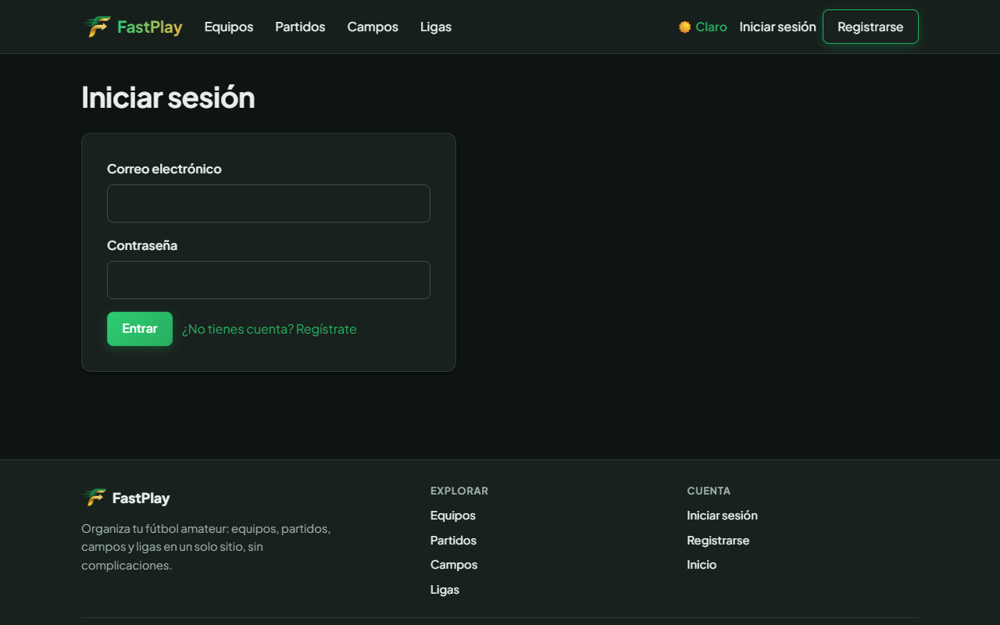
<!-- slide -->
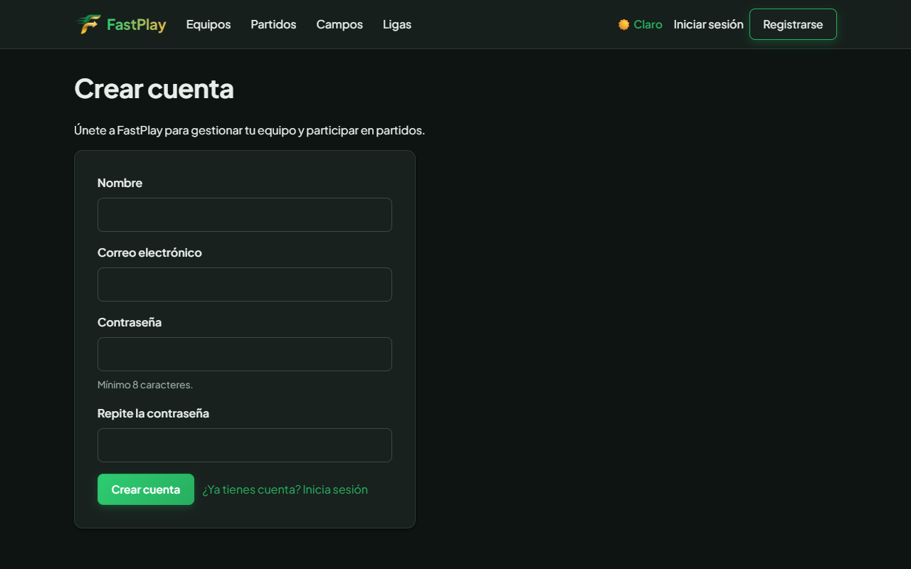
:::

#### 8.2.3. Perfil de Usuario y Listado de Equipos
El perfil de usuario muestra los datos personales básicos y el rol activo dentro de la plataforma. La sección de equipos presenta los conjuntos registrados en tarjetas limpias indicando su localidad.

::: carousel
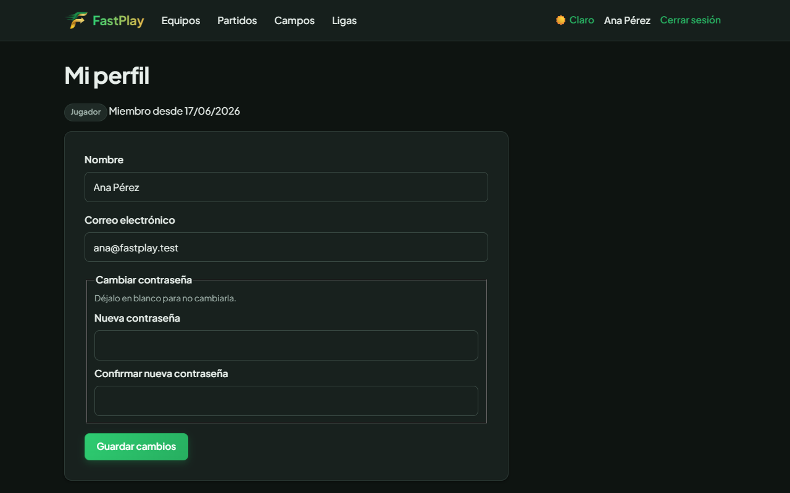
<!-- slide -->
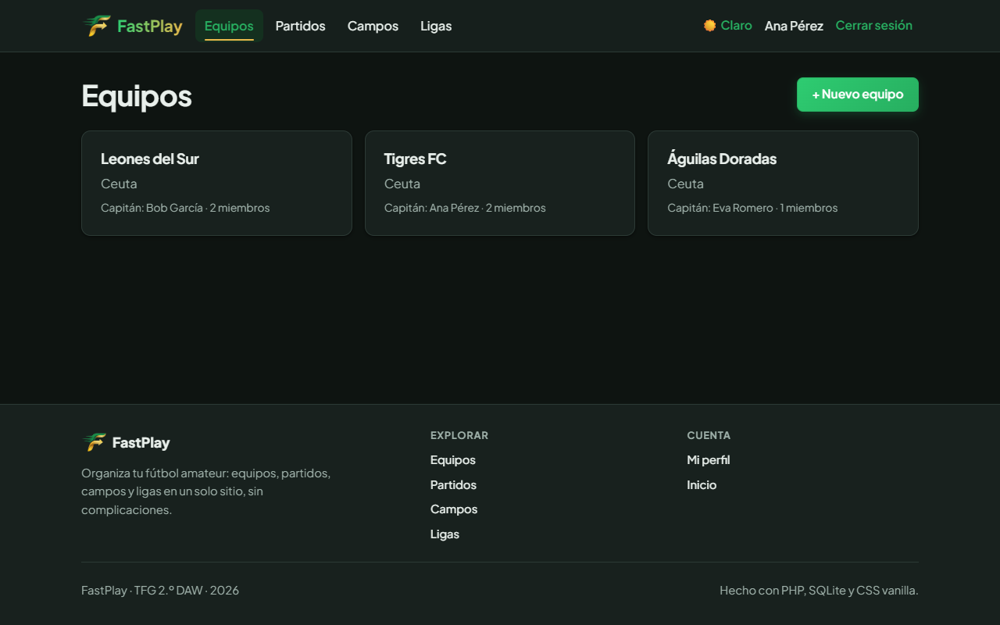
:::

#### 8.2.4. Ficha de Detalle de Equipo y Gestión de Plantilla
Si el usuario autenticado es el capitán del equipo, la ficha de detalle activa funciones administrativas para incorporar miembros mediante su correo electrónico o eliminarlos con un solo clic.

::: carousel
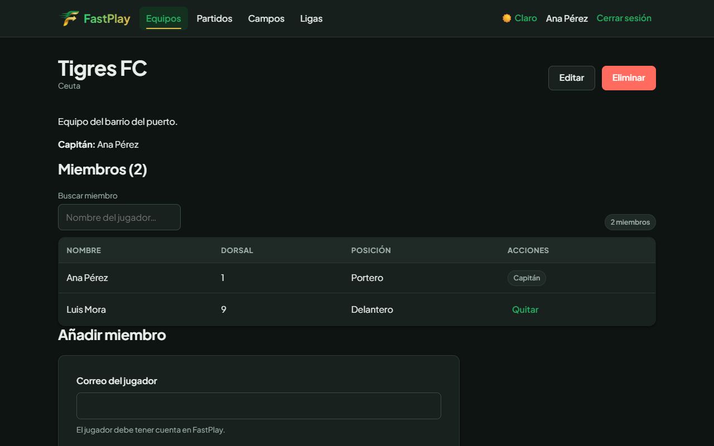
<!-- slide -->
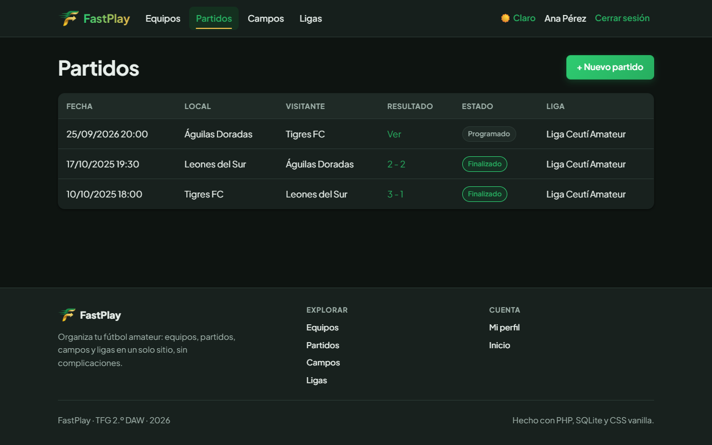
:::

#### 8.2.5. Campos de Juego y Ligas de Competición
El listado de campos detalla la superficie de juego de cada instalación. El módulo de ligas incluye clasificaciones calculadas en base a los goles a favor, en contra y el orden alfabético en caso de empate a puntos.

::: carousel
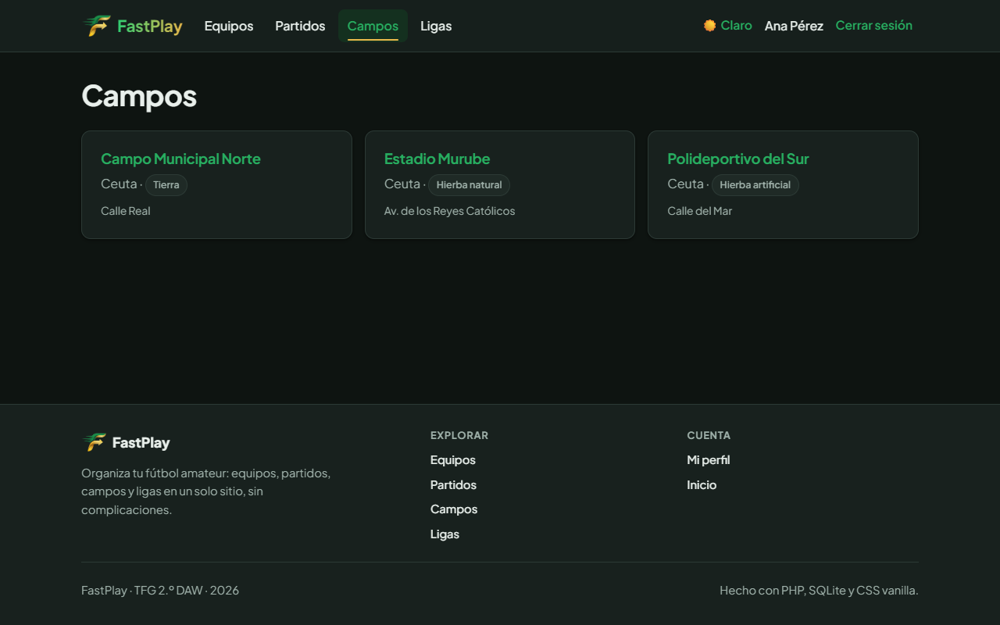
<!-- slide -->
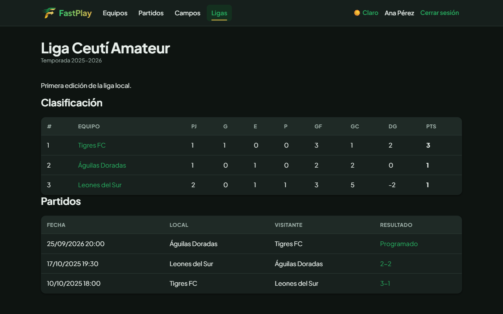
:::

#### 8.2.6. Consola del Administrador del Sistema
Los usuarios con privilegios de administrador disponen de un acceso directo a la consola de control, desde donde pueden crear campos y dar de alta nuevas liguillas competitivas para la temporada actual.

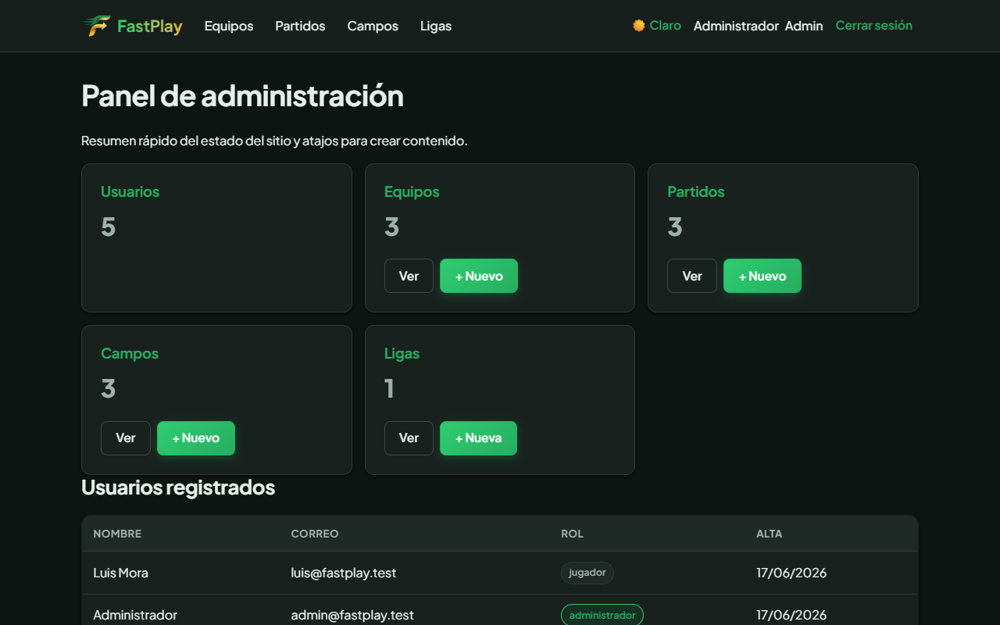

---

## 9. Desarrollo en Entorno Servidor (DWES)

### 9.1. Estructura de Directorios del Código Fuente
El código backend está organizado bajo un patrón MVC limpio y plano, lo que facilita enormemente su comprensión y mantenimiento:

```text
Fastplay/
├── app/
│   ├── controladores/    # Controladores específicos de cada módulo
│   ├── modelos/          # Modelos de datos y reglas de negocio
│   └── nucleo/           # Clases del núcleo (Controlador base, Enrutador, PDO...)
├── base_datos/
│   ├── esquema.sql       # Declaraciones CREATE TABLE para SQLite
│   ├── sembrar.php       # Sembrador de datos de demostración
│   └── fastplay.sqlite   # Archivo binario de la base de datos (autogenerado)
├── config/
│   └── configuracion.php # Constantes del sistema, rutas físicas y configuración
├── public/
│   ├── index.php         # Front Controller (único punto de entrada)
│   ├── css/              # Hojas de estilo CSS nativas
│   ├── imagenes/         # Iconos, logotipos y capturas de pantalla
│   └── js/               # Lógica en cliente (JavaScript modular)
└── router.php            # Router para el servidor embebido de PHP
```

---

### 9.2. Conexión de Base de Datos y Helpers
La comunicación con la base de datos SQLite se gestiona mediante la clase de utilidad [BaseDeDatos](file:///C:/Users/sadek/Desktop/Proyectos%20personales/RefactorizarTFG/Fastplay/app/nucleo/BaseDeDatos.php). Esta clase inyecta la conexión PDO y envuelve las operaciones repetitivas en métodos estáticos simples, tal como se puede apreciar en la siguiente captura de código fuente:

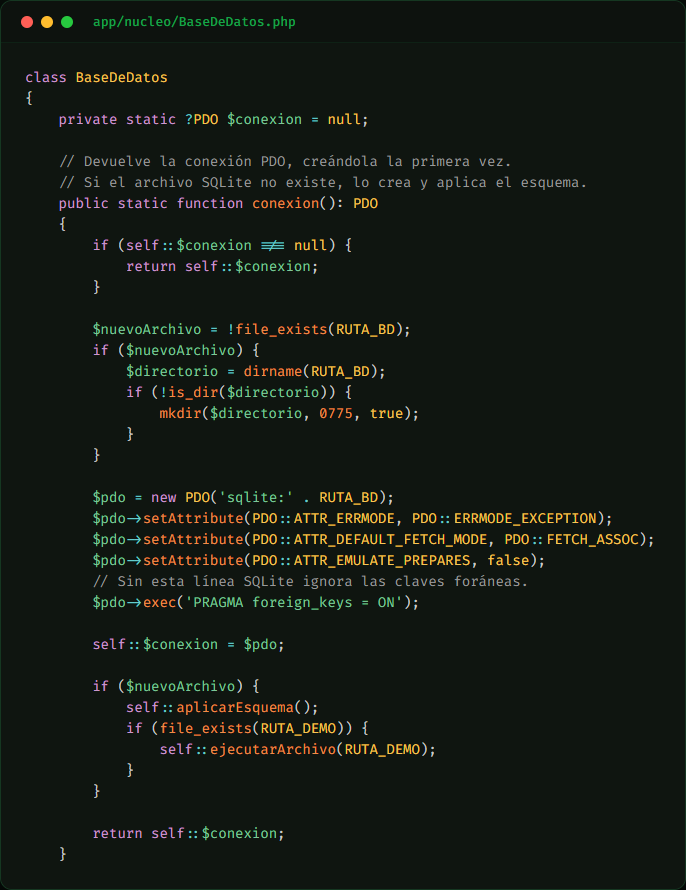

---

### 9.3. La Capa de Modelos (Active Record Estático)
A diferencia de sistemas complejos que utilizan ORMs pesados (como Doctrine o Eloquent), en FastPlay cada modelo se define como una clase PHP con métodos estáticos enfocados a resolver consultas específicas contra la base de datos. 

Por ejemplo, la clase de modelo [Liga](file:///C:/Users/sadek/Desktop/Proyectos%20personales/RefactorizarTFG/Fastplay/app/modelos/Liga.php) se encarga de calcular matemáticamente la clasificación general de una liga en tiempo real combinando sentencias de agregación comunes de SQL:

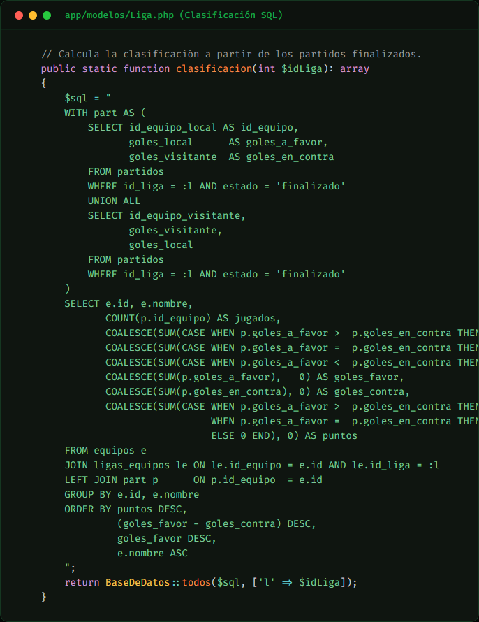

---

### 9.4. Controladores y Enrutamiento Centralizado
El enrutador lee las peticiones del navegador y las despacha mapeando patrones URL dinámicos (como `/equipos/{id}`) a su correspondiente controlador y acción. Todos los controladores de la aplicación heredan del [Controlador](file:///C:/Users/sadek/Desktop/Proyectos%20personales/RefactorizarTFG/Fastplay/app/nucleo/Controlador.php) base. Este expone helpers comunes de renderizado de vistas, inyección de variables dinámicas al layout principal, redirecciones y comprobación de autenticación del usuario:

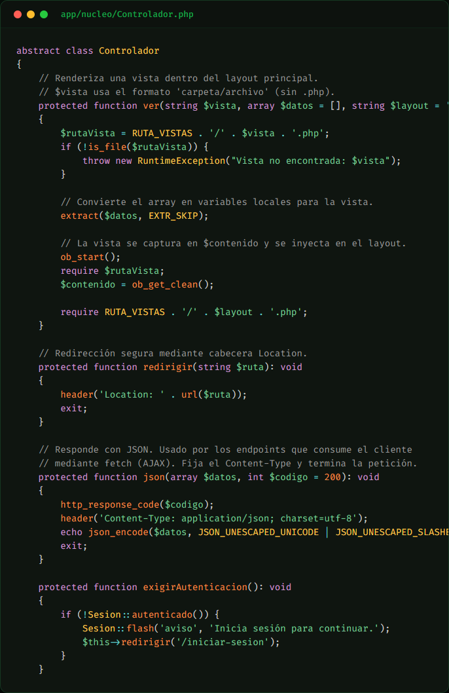

---

### 9.5. Seguridad en el Servidor (CSRF y Cifrado)
La seguridad en la manipulación de base de datos se garantiza en dos puntos críticos:
1. **Cifrado de Contraseñas:** Se realiza utilizando `password_hash` con el algoritmo nativo `PASSWORD_DEFAULT` (que actualmente resuelve a `bcrypt`), y se verifica mediante `password_verify` en el controlador de login.
2. **Protección CSRF:** Todas las peticiones de modificación (POST) deben incluir obligatoriamente el token CSRF generado en la sesión. La validación se gestiona de forma centralizada mediante la clase [Csrf](file:///C:/Users/sadek/Desktop/Proyectos%20personales/RefactorizarTFG/Fastplay/app/nucleo/Csrf.php), previniendo ataques maliciosos de suplantación:

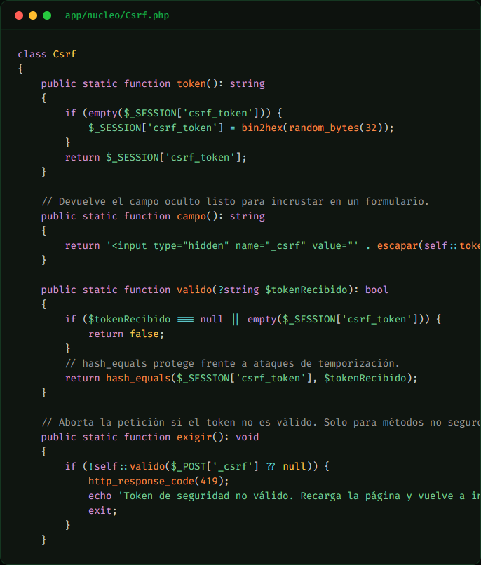

---

## 10. Desarrollo en Entorno Cliente (DWEC)

### 10.1. Persistencia local de preferencias (LocalStorage)
La interactividad en cliente se organiza en ficheros JavaScript independientes cargados con el atributo `defer`. Para la persistencia del tema visual claro/oscuro de FastPlay, se utiliza `localStorage` encapsulado en un bloque `try/catch` para evitar fallos si el usuario bloquea el almacenamiento en su navegador (por ejemplo, al navegar en modo incógnito):

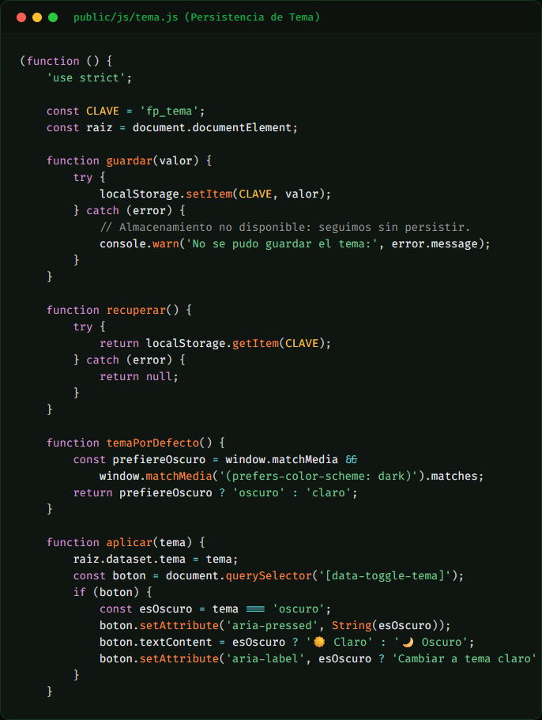

---

### 10.2. Cookies y Consentimiento Legal
Para cumplir con las regulaciones de privacidad vigentes, FastPlay implementa un banner de cookies dinámico. La lectura, escritura e invalidación de cookies se realiza mediante JavaScript nativo, utilizando el prefijo `fp_client_` para evitar colisiones con las cookies de sesión del servidor:

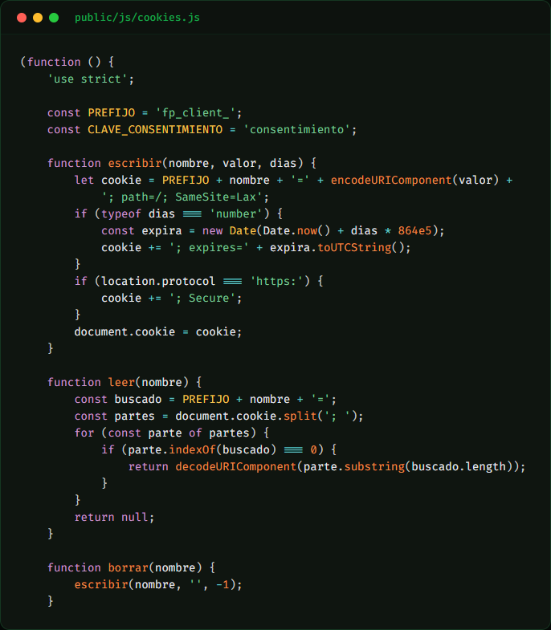

---

### 10.3. Validación Semántica y Accesible con Regex
El archivo [validacion.js](file:///C:/Users/sadek/Desktop/Proyectos%20personales/RefactorizarTFG/Fastplay/public/js/validacion.js) centraliza un catálogo de expresiones regulares para comprobar la validez de los formularios. Las validaciones modifican dinámicamente los atributos de accesibilidad `aria-invalid` y asocian mensajes de ayuda legibles mediante `aria-describedby` al salir de cada campo input:

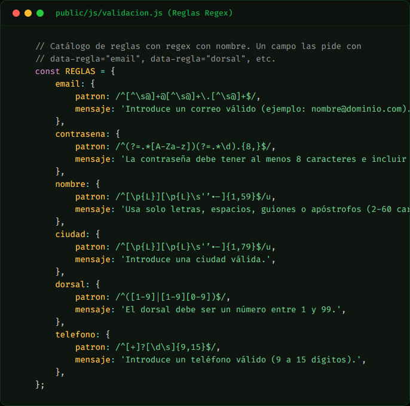

---

### 10.4. Manipulación del DOM y Peticiones Asíncronas (AJAX)
La página de inicio utiliza la API Fetch de forma asíncrona para consultar el endpoint `/api/contexto` y modificar la interfaz de usuario en tiempo real en función de la sesión actual de la máquina cliente, reconstruyendo dinámicamente el DOM de manera segura:

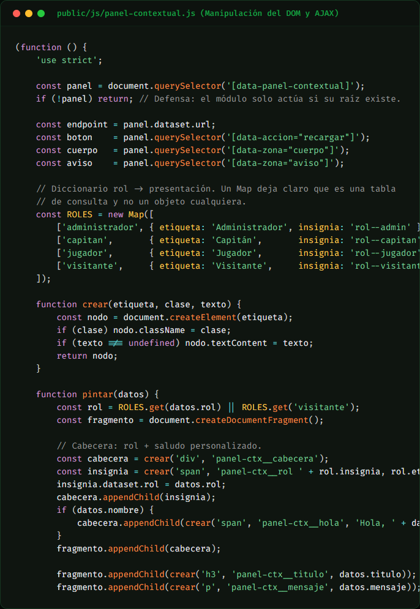

---

## 11. Propuesta de Escalabilidad y Arquitectura Futura

Si FastPlay tuviese que escalar para dar servicio a miles de usuarios a nivel nacional, se propone una evolución arquitectónica incremental en tres fases de desarrollo técnico:

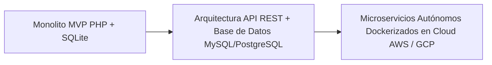
```mermaid
graph LR
    A[Monolito MVP PHP + SQLite] --> B[Arquitectura API REST + Base de Datos MySQL/PostgreSQL]
    B --> C[Microservicios Autónomos Dockerizados en Cloud AWS / GCP]
```

### 11.1. Propuesta de Microservicios
1. **Servicio de Autenticación (AuthService):** Gestión e inicialización de cuentas de usuario y tokens de sesión.
2. **Servicio de Gestión Deportiva (TeamService):** Lógica correspondiente a escuadras, convocatorias y listados de jugadores.
3. **Servicio de Clasificación y Ligas (LeagueService):** Motor de cálculo asíncrono de estadísticas y rankings competitivos.

### 11.2. Infraestructura y Monitorización
* **Caché con Redis:** Para almacenar las clasificaciones de las liguillas y los datos de perfil estáticos, reduciendo la carga de consultas sobre el servidor principal de base de datos.
* **Colas de Mensajería (RabbitMQ):** Para procesar envíos de correos de confirmación o recalculado de clasificaciones en segundo plano, evitando latencias de carga al usuario final.
* **Observabilidad (Prometheus + Grafana):** Visualización de métricas críticas (tiempos de respuesta de la API, consumo de CPU de las máquinas locales) e inicialización de alertas si la tasa de errores en producción supera el 1%.

---

## 12. Conclusiones

FastPlay demuestra que es posible construir una plataforma de gestión deportiva robusta, atractiva y funcional utilizando los cimientos de la programación clásica: **PHP puro para el backend (MVC)** y **JavaScript vanilla para el frontend**. 

El proyecto resuelve de manera elegante la complejidad de coordinar equipos, agendar partidos en instalaciones locales y mantener clasificaciones en tiempo real sin saturar al usuario con interfaces caóticas. Cumple con creces los objetivos académicos establecidos, sirviendo como una base sólida, modular y sumamente fácil de exponer ante un tribunal de evaluación técnica.

---

## 13. Bibliografía

### 13.1. Documentación Oficial
* **PHP Group:** *PHP Manual*. Disponible en: [php.net/manual/es](https://www.php.net/manual/es/)
* **PHP Group:** *PDO (PHP Data Objects)*. Disponible en: [php.net/manual/es/book.pdo.php](https://www.php.net/manual/es/book.pdo.php)
* **SQLite Consortium:** *SQLite SQL Syntax*. Disponible en: [sqlite.org/lang.html](https://www.sqlite.org/lang.html)

### 13.2. Estándares Web y Seguridad
* **Mozilla Developer Network (MDN):** *MDN Web Docs (JavaScript, DOM, Web Storage y Fetch)*. Disponible en: [developer.mozilla.org](https://developer.mozilla.org/)
* **OWASP Foundation:** *OWASP Top Ten Web Application Security Risks*. Disponible en: [owasp.org/www-project-top-ten](https://owasp.org/www-project-top-ten/)
* **Agencia Española de Protección de Datos (AEPD):** *Guía para el uso de cookies*. Disponible en: [aepd.es](https://www.aepd.es/)
